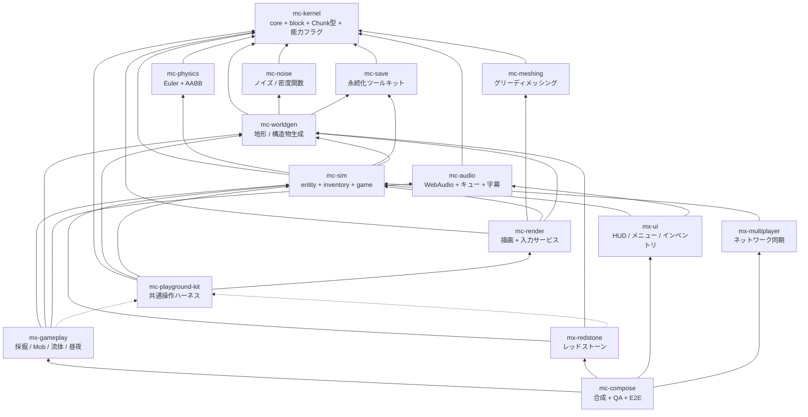

# アーキテクチャ

- 上位仕様: plan.md（**非公開**。§2 全体像、§3.4 mc-physics）
- 参照実装: `takeokunn/ts-minecraft`（凍結。仕様書兼テストオラクル）

## 1. なぜ 16 リポジトリなのか

単一リポジトリ（参照実装は 84k LOC）では「正しく動くことが保証される単位」が大きすぎ、
検証しきれない。plan.md §1 の解決策は次の 1 行に尽きる:

> ゲーム UX を構成する体験単位ごとにリポジトリを分け、それぞれが「実際にユーザが操作できるプレビュー」を同梱する

各リポジトリは「テスト green + プレビューで目視確認済み」で正しさを単独で閉じ、
合成リポジトリ（mc-compose）は各モジュールを束ねるだけの場所になる。

## 2. 4 階層

| 階層 | リポジトリ | 性質 |
| --- | --- | --- |
| 安定ライブラリ | kernel / **noise** / **meshing** / **physics** / save / audio | 純粋関数・狭い界面・変更頻度が低い。相互独立で並行構築可能 |
| 基盤 | worldgen / sim / render / playground-kit | 状態とサービス（**名詞**）。体験モジュールが乗る土台 |
| 体験モジュール | gameplay / redstone / ui / multiplayer | ルールと UI（**動詞**）。互いを知らず、基盤サービス経由でのみ会話 |
| 合成 | compose | Layer マージ + stage 順序表 + E2E。ロジックを持たない |

## 3. 依存グラフ（全体）



実線 = 実行時依存（`dependencies`）、点線 = プレビュー起動時のみ（`devDependencies`）。
plan.md §2.1 は 15 リポジトリを図示しているが、Step 0 で **mc-dev-meta**（開発用 workspace、実行時依存なし）が加わるため、
`scripts/check-dependency-whitelist.ts` が保持する roster は **16 行**である。

## 4. このリポジトリの位置

**mc-physics は最下層に近い「安定ライブラリ」層に属する。**

- **親（このリポジトリが依存してよい先）**: `mc-kernel` のみ。
- **子（このリポジトリに依存する側）**: `mc-sim` ただ 1 つ。

mc-physics がワールドに問うことは 1 つしかない —— 「このセルは solid か、どの形状で当たるか」。
その答えは注入されたコールバックとして受け取るので、ワールドにもチャンクマネージャにも
レンダラにも依存しない。

この注入方式は、plan.md §3.4 の「ブロックID名指し禁止」を強制可能にする仕組みでもある。
呼び出し側が能力フラグを解決し、mc-physics は boolean と形状しか見ない。
参照実装は逆をやっていた（`packages/game/domain/block-collision-predicates.ts:16-42` の
手書き denylist `PASSABLE_BLOCK_IDS`）。詳細は `responsibility.md` と `design-notes.md`。

## 5. 構成の成立条件（plan.md §2.3）

### 5.1 基盤 = 名詞、体験 = 動詞（§2.3-1）

`InventoryService` のような**状態の置き場**は基盤層に置く。
「掘ったらドロップしてインベントリに入る」という**ルール**は体験層に置く。

体験モジュール（`mx-*`）間の依存エッジは**ゼロ**である。
「採掘 → インベントリに入る」は mx-gameplay が mx-ui を呼ぶのではなく、
mc-sim の `InventoryService` を経由して実現する。

このルールは `scripts/check-dependency-whitelist.ts` の roster にそのまま埋め込まれており、
`test/check-dependency-whitelist.test.ts` の
「has no edges between experience modules」がアサーションとして保持している。

安定ライブラリ層は名詞でも動詞でもなく**関数**である。状態を持たず、サービスを提供せず、
`Layer` を公開しない。この層に `Ref` が現れたら設計を疑うこと。

### 5.2 mc-playground-kit が devDependency 専用である理由（§2.3-2）

**実行時入力サービス（キーボード / マウス / ポインタロック / タッチ / キーリマッピング）を
所有するのは mc-render であって mc-playground-kit ではない。**

mc-playground-kit は「ミニ平地ワールド + カメラ + レンダラ + 入力を 1 秒で束ねる糊」であり、
各体験モジュールからは **devDependency としてのみ**参照される。
もし入力サービスを kit 側に置いたら、kit は出荷ビルドに含まれないので、
**本番ゲームから入力処理が丸ごと消える**。

したがって:

- `mc-playground-kit` が `dependencies` に現れたら CI は失敗する
  （`check-dependency-whitelist.ts` の `DEV_ONLY_PACKAGES`、rule 6）。
- 出荷ソース（`index.ts` と `domain/`）からの import も失敗する。
- roster では **ノードとしては存在する**（kit 自身は worldgen / sim / render に実行時依存する）が、
  **どの行のターゲットにも現れない**。devDependency は実行時の辺を作らないので、循環にも参加しない。

なお mc-physics は kit を devDependency としても使わない。プレビューを持たない層だからである。

### 5.3 stage 実行順序表は mc-compose が唯一所有する（§2.3-3）

各モジュールは `StageRegistration` で**順序制約（`after`）を宣言するだけ**であり、
全順序（total order）を解決するのは mc-compose ただ 1 つである。

```typescript
// mc-kernel が型を定義。各体験モジュールが実装して公開する
interface StageRegistration {
  readonly id: StageId
  readonly after?: ReadonlyArray<StageId>   // 順序制約の宣言のみ
  readonly run: (dt: DeltaTimeSecs) => Effect.Effect<void, never, FrameServices>
}
```

標準の全順序の骨格（plan.md §4.2）:

```
input
  -> simulation (physics -> interactions -> entities -> fluids -> redstone -> time/weather)
  -> camera-mirror
  -> chunk-sync
  -> render
  -> post-fx
  -> hud-sync
```

mc-physics は stage を登録しない。物理は `simulation` stage の先頭に位置するが、
その stage を登録するのは状態を所有する mc-sim であり、mc-physics は mc-sim が呼ぶ
純粋関数を提供するだけである。

`camera-mirror` が `simulation` の後にあることに注意。カメラ姿勢の正は mc-sim が所有し、
THREE カメラはそのミラーである（plan.md §3.8）。参照実装は THREE カメラが正で
シミュレーションが描画から視線を読む逆転構造で、これが
「camera.position を読むな matrixWorld を使え」という慢性 gotcha の根源だった。

参照実装の轍: 合成層に 13k LOC のルールが堆積し、E2E でしか検証できなくなった。
「mc-compose の追加コードは Layer 合成と stage 順序表だけ」がレビュー規範である。

## 6. 依存ホワイトリスト CI（§2.3-5）

`scripts/check-dependency-whitelist.ts` は 16 リポジトリ共通のテンプレートである。
移植時に書き換えるのは冒頭で囲ってある `REPOSITORY_POLICY` の `thisPackage` だけでよい
（`dependencyGraph` は roster 全体なので全コピーで同一）。

| ルール | 内容 |
| --- | --- |
| ハード失敗 | 違反があれば必ず非ゼロ終了する。参照実装の `check-package-dag.ts` は警告を出して常に 0 で終了していた。失敗できないゲートはドキュメントであってゲートではない |
| 循環禁止 | 例外リストを設けない。参照実装は「co-evolution ペア」として 6 つの循環を合法化していた |
| 推移閉包の禁止 | A→B、B→C のとき A は C を import できない。mx-gameplay は mc-sim が mc-physics に依存しているという理由で mc-physics を import することはできない |
| kernel は例外 | mc-kernel はどこからでも import 可。ただし `package.json` への記載は必要（許可の例外であって、パッケージングの例外ではない） |
| 宣言と実体の一致 | import する `@nerima-games/*` は `package.json` に記載されていなければならない |
| kit は devDependency 専用 | §5.2 のとおり |
| `Date.now()` 禁止 | `Date.now()` / `new Date()` / `performance.now()` の 3 つ。時刻は注入された Clock Port から取得する |

`Date.now()` 禁止が lint ではなくスクリプト側にあるのは、oxlint 0.12 が
`no-restricted-syntax` も `no-restricted-properties` も実装しておらず、
`no-restricted-globals` も一覧に出るだけで実装されていないためである（0.12.0 で実測確認済み）。
Clock Port の実装アダプタだけは実クロックを 1 回読む必要があるので、
その行に `mc-kernel-allow-time-source` コメントを付けると除外される。

## 7. スケルトン段階の依存宣言について

**現時点で `package.json` の `dependencies` は `effect` だけである。**
`@nerima-games/mc-kernel` は入っていない。理由は 2 つ:

1. まだ何も publish されていない（bottom-up に publish してから pin する方式）。
2. スケルトンには import すべき兄弟コードがまだ存在しない。

意図されたグラフは `check-dependency-whitelist.ts` の roster と本ドキュメントに記録されている。
グラフは仕様であり、最初の publish より前に循環検出を意味あるものにしているのはこの記録である。

## 参照

- `responsibility.md` — このリポジトリの責務と、意図的に含めないもの
- `public-api.md` — 公開 API と参照実装での裏付け
- `design-notes.md` — 設計注意とその回帰テスト名
- `versioning.md` — 0.x → 1.0.0 の方針と publish
