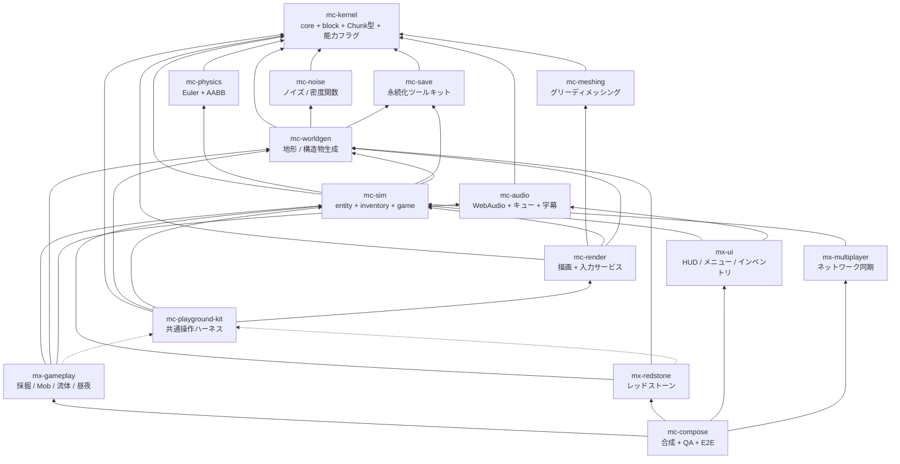

# アーキテクチャ

- 上位仕様: plan.md（**非公開**。§2 全体像、§3.4 mc-physics）
- 参照実装: `takeokunn/ts-minecraft`（凍結。仕様書兼テストオラクル）

## 1. なぜ 16 リポジトリなのか

単一リポジトリ（参照実装は 84k LOC）では「正しく動くことが保証される単位」が大きすぎ、
検証しきれない。plan.md §1 の解決策は次の 1 行に尽きる:

> ゲーム UX を構成する体験単位ごとにリポジトリを分け、それぞれが「実際にユーザが操作できるプレビュー」を同梱する

各リポジトリは「テスト green + プレビューで目視確認済み」で正しさを単独で閉じ、
合成リポジトリ（mc-compose）は各モジュールを束ねるだけの場所になる。

## 2. 4 階層

| 階層 | リポジトリ | 性質 |
| --- | --- | --- |
| 安定ライブラリ | kernel / **noise** / **meshing** / **physics** / save / audio | 純粋関数・狭い界面・変更頻度が低い。相互独立で並行構築可能 |
| 基盤 | worldgen / sim / render / playground-kit | 状態とサービス（**名詞**）。体験モジュールが乗る土台 |
| 体験モジュール | gameplay / redstone / ui / multiplayer | ルールと UI（**動詞**）。互いを知らず、基盤サービス経由でのみ会話 |
| 合成 | compose | Layer マージ + stage 順序表 + E2E。ロジックを持たない |

## 3. 依存グラフ（全体）



実線 = 実行時依存（`dependencies`）、点線 = プレビュー起動時のみ（`devDependencies`）。
plan.md §2.1 は 15 リポジトリを図示しているが、Step 0 で **mc-dev-meta**（開発用 workspace、実行時依存なし）が加わるため、
org 全体の roster は **16 行**である（組織共通の依存ポリシー §1。かつては
`scripts/check-dependency-whitelist.ts` がこの roster を保持していたが、org 標準への移行で
全廃され、組織共通の依存ポリシーがグラフの正典を引き継いだ）。

## 4. このリポジトリの位置

**mc-physics は最下層に近い「安定ライブラリ」層に属する。**

- **親（このリポジトリが依存してよい先）**: `mc-kernel` のみ。
- **子（このリポジトリに依存する側）**: `mc-sim` ただ 1 つ。

mc-physics がワールドに問うことは 1 つしかない —— 「このセルの
`BlockProperties` は何か」。`null` は衝突しないセルを表す。状態依存・複合形状は別の
コールバックで注入できるので、ワールドにもチャンクマネージャにもレンダラにも依存しない。

この注入方式は、plan.md §3.4 の「ブロックID名指し禁止」を強制可能にする仕組みでもある。
チャンク座標から ID を読む処理と state の解決は呼び出し側に残るが、`kernel-world` は
mc-kernel の registry を直接使って `BlockProperties | null` を返せる。mc-physics は
kernel の `collisionShape` と必要なら注入された形状だけを見る。
参照実装は逆をやっていた（`packages/game/domain/block-collision-predicates.ts:16-42` の
手書き denylist `PASSABLE_BLOCK_IDS`）。詳細は `responsibility.md` と `design-notes.md`。

## 5. 構成の成立条件（plan.md §2.3）

### 5.1 基盤 = 名詞、体験 = 動詞（§2.3-1）

`InventoryService` のような**状態の置き場**は基盤層に置く。
「掘ったらドロップしてインベントリに入る」という**ルール**は体験層に置く。

体験モジュール（`mx-*`）間の依存エッジは**ゼロ**である。
「採掘 → インベントリに入る」は mx-gameplay が mx-ui を呼ぶのではなく、
mc-sim の `InventoryService` を経由して実現する。

このルールは各体験モジュールの `.oxlintrc.json` の `no-restricted-imports` が個別に強制する
（組織共通の依存ポリシー §2 ルール2）。かつては 16 リポジトリ共通の
`scripts/check-dependency-whitelist.ts` の roster に埋め込まれ、
`test/check-dependency-whitelist.test.ts` の「has no edges between experience modules」が
アサーションとして保持していたが、この2ファイルは org 標準への移行で全廃された(§6 参照)。

安定ライブラリ層は名詞でも動詞でもなく**関数**である。状態を持たず、サービスを提供せず、
`Layer` を公開しない。この層に `Ref` が現れたら設計を疑うこと。

### 5.2 mc-playground-kit が devDependency 専用である理由（§2.3-2）

**実行時入力サービス（キーボード / マウス / ポインタロック / タッチ / キーリマッピング）を
所有するのは mc-render であって mc-playground-kit ではない。**

mc-playground-kit は「ミニ平地ワールド + カメラ + レンダラ + 入力を 1 秒で束ねる糊」であり、
各体験モジュールからは **devDependency としてのみ**参照される。
もし入力サービスを kit 側に置いたら、kit は出荷ビルドに含まれないので、
**本番ゲームから入力処理が丸ごと消える**。

したがって:

- `mc-playground-kit` が `dependencies` に現れる、または出荷ソース
  （`src/index.ts` と `src/domain/`）から import されることは、その消費側リポジトリの
  `.oxlintrc.json` の `no-restricted-imports` が禁止する
  （組織共通の依存ポリシー §3。かつては `check-dependency-whitelist.ts` の
  `DEV_ONLY_PACKAGES`、rule 6 が同じ役割を担っていた)。
- devDependency は実行時の辺を作らないので、循環にも参加しない。

なお mc-physics は kit を devDependency としても使わない。プレビューを持たない層だからである。

### 5.3 stage 実行順序表は mc-compose が唯一所有する（§2.3-3）

各モジュールは `StageRegistration` で**順序制約（`after`）を宣言するだけ**であり、
全順序（total order）を解決するのは mc-compose ただ 1 つである。

```typescript
// mc-kernel が型を定義。各体験モジュールが実装して公開する
interface StageRegistration {
  readonly id: StageId
  readonly after?: ReadonlyArray<StageId>   // 順序制約の宣言のみ
  readonly run: (dt: DeltaTimeSecs) => Effect.Effect<void, never, FrameServices>
}
```

標準の全順序の骨格（plan.md §4.2）:

```
input
  -> simulation (physics -> interactions -> entities -> fluids -> redstone -> time/weather)
  -> camera-mirror
  -> chunk-sync
  -> render
  -> post-fx
  -> hud-sync
```

mc-physics は stage を登録しない。物理は `simulation` stage の先頭に位置するが、
その stage を登録するのは状態を所有する mc-sim であり、mc-physics は mc-sim が呼ぶ
純粋関数を提供するだけである。

`camera-mirror` が `simulation` の後にあることに注意。カメラ姿勢の正は mc-sim が所有し、
THREE カメラはそのミラーである（plan.md §3.8）。参照実装は THREE カメラが正で
シミュレーションが描画から視線を読む逆転構造で、これが
「camera.position を読むな matrixWorld を使え」という慢性 gotcha の根源だった。

参照実装の轍: 合成層に 13k LOC のルールが堆積し、E2E でしか検証できなくなった。
「mc-compose の追加コードは Layer 合成と stage 順序表だけ」がレビュー規範である。

## 6. 依存の実効機構（§2.3-5、廃止と移行）

**`scripts/check-dependency-whitelist.ts`（+ `test/check-dependency-whitelist.test.ts` +
`pnpm check:deps`）は組織共通の標準移行に伴い廃止された。** これは 16 リポジトリ共通の
テンプレートで、移植時に書き換えるのは冒頭で囲ってある `REPOSITORY_POLICY` の
`thisPackage` だけでよい設計だったが、組織共通のパッケージ標準で廃止が決まり、削除済みである。

**代替は各リポジトリの `.oxlintrc.json` に書く `no-restricted-imports` である**
（組織共通の依存ポリシー §5）。旧スクリプトが担っていたルールのうち、この移行後にどう
担保されるかを以下に示す。

| ルール | 旧: check-dependency-whitelist.ts | 新: .oxlintrc.json |
| --- | --- | --- |
| 許可されない `@nerima-games/*` import の禁止 | roster 全体を持つ共通スクリプトが判定 | 自リポジトリの `no-restricted-imports`(`patterns`/`group`)が判定。mc-physics は Tier1 なので `mc-kernel` を除く全 `@nerima-games/*` を禁止する |
| 循環禁止 | `findCycles` が全リポジトリの roster に対して判定 | 個々の `.oxlintrc.json` では検出できない(自リポジトリの許可先しか見えない)。組織共通の依存ポリシーがグラフの正典として非循環性を保証する |
| 推移閉包の禁止 | `findTransitivePath` が判定 | 同上。`no-restricted-imports` は直接 import のみを見るので、そもそも許可されていない先への import は直接 import 時点で弾かれる |
| kernel は例外 | ハードコードされた例外処理 | `no-restricted-imports` の `patterns[].group` に gitignore 風の否定パターン(`!@nerima-games/mc-kernel`)を書いて表現(正規表現の否定先読みは oxlint 1.75.0 の regex エンジンが未実装で使えないと判明した) |
| 宣言と実体の一致(`package.json` と import の一致) | `checkDeclaredDependencies` が判定 | oxlint では表現できない。組織共通のパッケージ標準としては要求しない |
| kit は devDependency 専用 | `DEV_ONLY_PACKAGES` | 消費側リポジトリの `.oxlintrc.json` に個別のパターンとして書く(mc-physics は kit を使わないため該当なし) |
| シミュレーションコードの時計アクセス禁止 | `findBannedTimeSources` | oxlint では表現できない(oxlint 1.75 時点でも `no-restricted-syntax` 等が未実装。`.oxlintrc.json` 冒頭コメント参照)。`src/` はレビューで担保し、計測専用の `scripts/benchmark.mjs` は例外として `performance.now()` を使う |

**`mc-physics` の現在の `.oxlintrc.json`**:

```jsonc
"no-restricted-imports": ["warn", {
  "patterns": [{
    "group": ["@nerima-games/**", "!@nerima-games/mc-kernel", "!@nerima-games/mc-kernel/**"],
    "message": "mc-physics is a Tier1 library and must not depend on any other @nerima-games/* package. mc-kernel is universally importable and exempt."
  }]
}]
```

`group` はイグノアファイル風(gitignore-style)のグロブで、`!` プレフィックスが例外を表す。
以前は `regex` 一本で `^@nerima-games/(?!mc-kernel\b).+`(否定先読み)を使っていたが、oxlint
1.75.0 のレギュラーエクスプレッションエンジンは先読み(lookahead)を実装しておらず、この
パターンは**常にマッチしない**(エラーにもならず静かに無効化される)ことを実際に確認した:
`@nerima-games/mc-worldgen` を import するファイルに対して 0 件の診断が出た。`group` 形式に
切り替えたところ、禁止対象(`mc-worldgen` のルートとサブパス)は検出し、例外
(`mc-kernel` のルートとサブパス)は素通しし、`mc-kernel-evil` のような紛らわしい名前は
引き続き検出することを確認済み。

## 7. 依存宣言と公開成果物

**`package.json` の `dependencies` は `@nerima-games/mc-kernel@0.5.0` と `effect` である。**
mc-kernel の共有データを直接利用し、同じ値オブジェクトやブロック特性をこのリポジトリへ複製しない。

TypeScript のソースを実行時に公開するのではなく、`pnpm build` で ESM の `dist/index.js` と
型宣言・source map を生成し、`package.json` の `exports` / `files` は `dist` に固定する。

依存グラフは組織共通の依存ポリシー（org 共通の正典）と本ドキュメントに記録されている。
公開操作そのものはリリース担当者の手順に残し、パッケージ生成と `prepublishOnly` の検証はこのリポジトリで担保する。

## 参照

- `responsibility.md` — このリポジトリの責務と、意図的に含めないもの
- `public-api.md` — 公開 API と参照実装での裏付け
- `design-notes.md` — 設計注意とその回帰テスト名
- `versioning.md` — 0.x → 1.0.0 の方針と公開成果物
